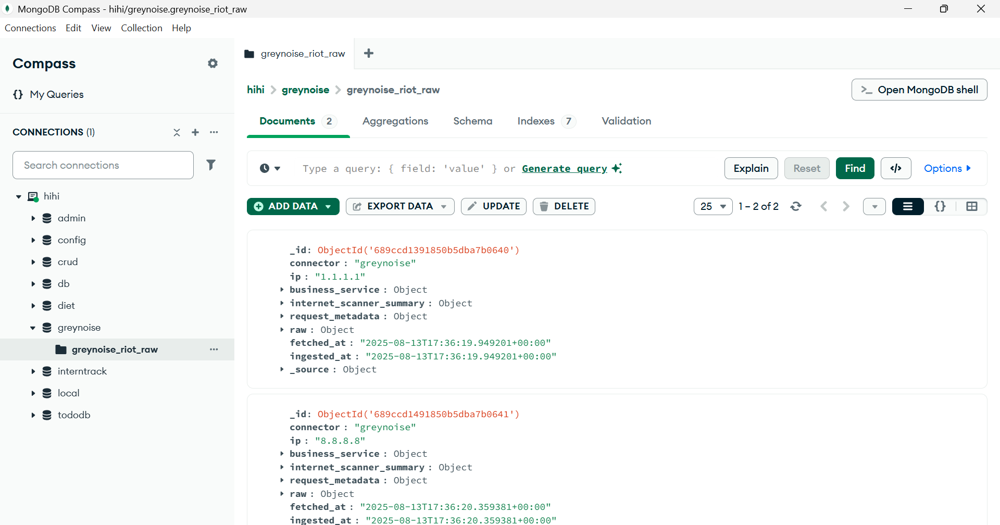

# Software Architecture - Assignment 1

**Niranjana A**  
**3122225001083**  
**CSE B**

---

## GreyNoise IP Python ETL Data Connector

This project implements a Python-based ETL (Extract, Transform, Load) pipeline that fetches IP intelligence data from the **GreyNoise API**, processes it into a MongoDB-friendly structure, and inserts the results into a specified MongoDB collection.

---

## Features

- Fetches IP details from GreyNoise.
- Structures data for consistent MongoDB insertion.
- Adds fetch and insert timestamps.
- Accepts IPs from `.env` or an input file.
- Handles errors, rate limits, and retries with backoff.
- Supports dry-run mode for testing without database writes.

---

## API Endpoint Details

- **Base URL:** `https://api.greynoise.io`
- **Endpoint:** `/v3/ip/{ip_address}`
- **Method:** `GET`

### Headers Required

| Header | Value |
|--------|-------|
| Accept | application/json |
| key    | Your GreyNoise API key |

- **Query Parameters:** None (IP is part of the URL)  
- **Example Request URL:**  
  ```
  https://api.greynoise.io/v3/ip/8.8.8.8
  ```

---

## Project Structure

```
custom-python-etl-data-connector-nna-12/
├── etl_connector.py       # Main ETL script
├── ENV_TEMPLATE           # Template for environment variables
├── .gitignore             # Ignore .env and unnecessary files
├── requirements.txt       # Python dependencies
└── README.md              # Project documentation
```

---

## Usage

1. **Clone your branch from the main repository:**
   ```bash
   git checkout main
   git pull origin main
   git checkout -b branch_name
   ```

2. **Install dependencies:**
   ```bash
   pip install -r requirements.txt
   ```

3. **Create a `.env` file** with the required environment variables.

4. **Run the script** to fetch and store data for one or more IP addresses:

- **Run with default IPs from `.env`:**
   ```bash
   python etl_connector.py
   ```

- **Dry-run mode** (see processed output without inserting into MongoDB):
   ```bash
   python etl_connector.py --dry-run
   ```

- **Override IP list from the command line:**
   ```bash
   python etl_connector.py --ips 8.8.8.8
   ```

---

## Sample Output (Dry-Run Mode)

```json
{
  "connector": "greynoise",
  "ip": "8.8.8.8",
  "business_service": null,
  "internet_scanner_summary": {
    "seen": true,
    "classification": "benign",
    "first_seen": "2024-07-01",
    "last_seen": "2024-08-10",
    "found": true,
    "actor": null,
    "bot": false,
    "vpn": false,
    "tags": ["public-dns"],
    "metadata": {}
  },
  "request_metadata": {
    "country": "US",
    "asn": "AS15169",
    "organization": "Google LLC"
  },
  "raw": { ... full API response ... },
  "fetched_at": "2025-08-13T12:34:56+00:00",
  "ingested_at": "2025-08-13T12:34:56+00:00",
  "_source": {
    "endpoint": "https://api.greynoise.io/v3/ip/8.8.8.8"
  }
}
```

---

## Output Screenshots

**Terminal Output**


**MongoDB Document View**


**Additional MongoDB Records**

